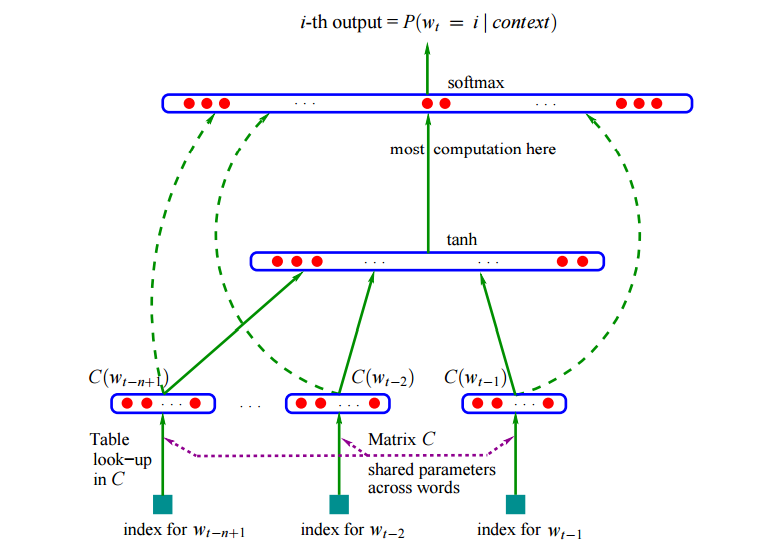

# MakeMore Project

This project explores text generation techniques, focusing on the creation and manipulation of names using bigrams. It is designed to provide insights into natural language processing (NLP) techniques and how they can be applied to generate meaningful and creative text outputs.

## Project Structure

- `makemore_bigrams.ipynb`: An advanced exploration of bigram models for text generation.
- `makemore_part1_bigrams.ipynb`: Original Part 1 of the bigram model exploration created by Andrej, focusing on foundational concepts.
- `names.txt`: A dataset of names used for training and testing the models.
- `Notes.txt`: Additional information and insights gathered during the project development.
- `.gitignore`: Specifies intentionally untracked files to ignore.
